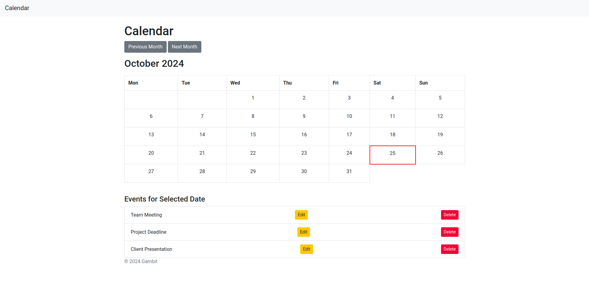

# PHP Calendar

This is a PHP-based calendar application that allows users to view, add, edit, and delete events. It features a user-friendly interface built with HTML, CSS, and JavaScript, making it easy to navigate and manage events.

## Features

- **Dynamic Calendar**: The calendar is generated dynamically, allowing users to navigate through months and view events for each day.
- **Event Management**: Users can add new events with details like title, start date, end date, and description.
- **Annual Events**: Option to create events that repeat every year.
- **Event Editing and Deletion**: Users can edit existing events or delete them as needed.
- **Modal Interface**: Events can be managed through a modal dialog for a seamless user experience.

## Installation

1. Clone the repository:
   ```bash
   git clone https://github.com/Gambitdutku/PHP-Calendar.git
   ```

2. Navigate to the project directory:
   ```bash
   cd PHP-Calendar
   ```

3. Ensure you have a web server with PHP and a database set up. Import the database schema provided in `db.sql`.

4. Configure your database connection in `db.php`, and import [calendar_db.sql](db/calendar_db.sql)

5. Open `index.php` in your web browser to access the calendar.

## Screenshots



## Technologies Used

- PHP
- HTML
- CSS
- JavaScript
- Bootstrap

## Contributing

Contributions are welcome! Please feel free to submit a pull request.

## License

This project is licensed under the MIT License.

## Acknowledgements

- Thanks to the open-source community for the resources and libraries used in this project.